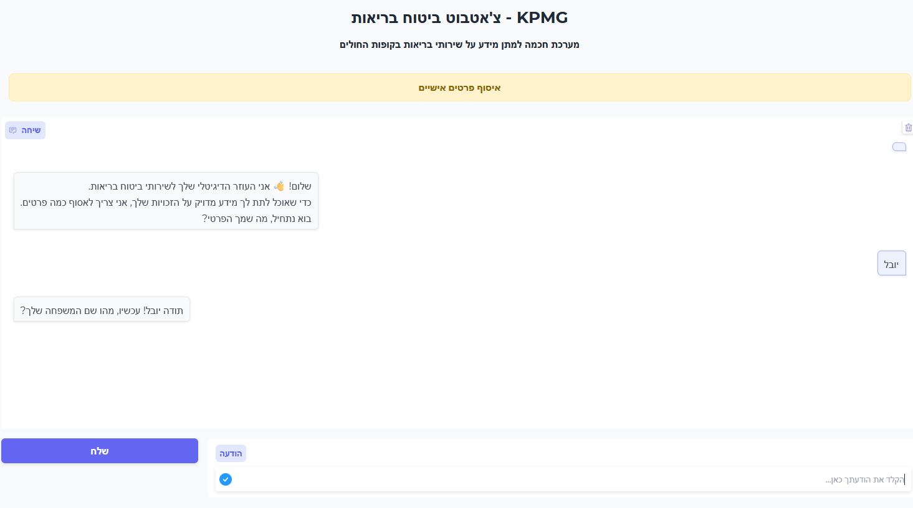
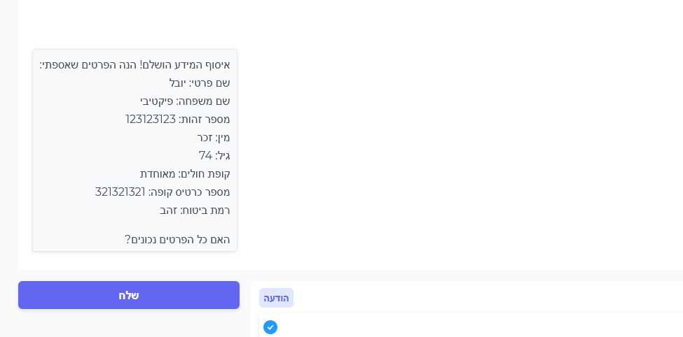
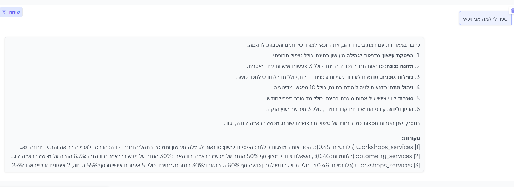

# Setup and Run Instructions


## Installation Steps

### 1. Clone the Repository

```bash
git clone https://github.com/golyuval/KPMG-GenAI.git
cd ./KPMG-GenAI/Part-2/
```

### 2. Create Virtual Environment

```bash
# Windows
python -m venv venv
venv\Scripts\activate

# Linux/Mac
python -m venv venv
source venv/bin/activate
```

### 3. Install Dependencies

```bash
pip install -r requirements.txt
```

### 4. Configure Environment Variables

Create a `.env` file in the root directory:

```env
# Azure Document Intelligence
AZURE_DOC_INT_KEY= ...
AZURE_DOC_INT_ENDPOINT= ...

# Azure OpenAI
AZURE_OPENAI_KEY= ...
AZURE_OPENAI_VERSION= ...
AZURE_OPENAI_ENDPOINT= ...
```

### 5. Verify Data Files

Ensure the following directories exist and contain the required files:
- `Data/phase1_data/`: PDF files for Part 1
- `Data/phase2_data/`: HTML files for Part 2 knowledge base

## Running Part 2 (HMO Chatbot)

### 1. Start the Backend Server

```bash
python ./Part_2/Server/app.py
```

Expected output:

```
INFO:     Started server process [xxxxx]
INFO:     Waiting for application startup.
INFO:     Application startup complete.
INFO:     Uvicorn running on http://127.0.0.1:8000
```

### 2. Start the Frontend (New Terminal)

```bash
python ./Part_2/Client/app.py
```

Expected output:
```
Running on local URL:  http://127.0.0.1:7860
Running on public URL: https://xxxxx.gradio.live
```

### 3. Access the Application

- Local: Open `http://127.0.0.1:7860` in your browser
- Public: Use the Gradio public URL (if share=True)

## Usage Guide

### Phase 1: Information Collection

1. The chatbot will greet you and ask for your information



2. Provide the following details when asked:
   - First name (שם פרטי)
   - Last name (שם משפחה)
   - ID number (9 digits)
   - Gender (זכר/נקבה)
   - Age (0-120)
   - HMO (מכבי/מאוחדת/כללית)
   - HMO card number (9 digits)
   - Insurance tier (זהב/כסף/ארד)

### Phase 1.5: Verification

1. Review the collected information
2. Confirm if correct or request changes
3. Once verified, proceed to Q&A



### Phase 2: Q&A

Ask questions about your HMO services. The bot will provide answers based on your HMO and insurance tier.



## Monitoring and Debugging

### API Endpoints for Monitoring

- Health Check `http://localhost:8000/health`
- RAG Statistics `http://localhost:8000/rag-stats`
- Token Usage `http://localhost:8000/token-usage`
- Log info `http://localhost:8000/logs/info`
- Log error `http://localhost:8000/logs/error`


## Needed for production 
- Secure routes with API key
- Invocation of actual field validators
- Testing caching mechanizm
