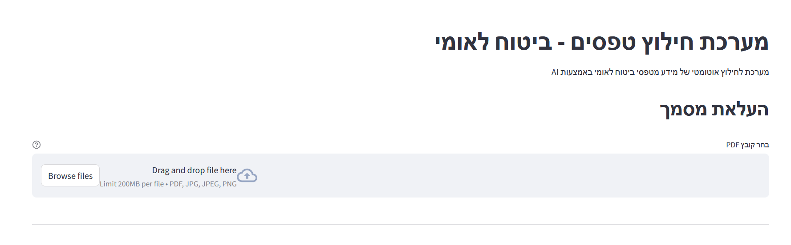
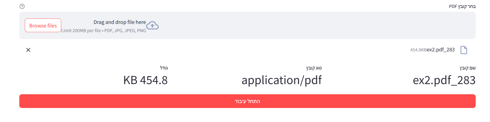
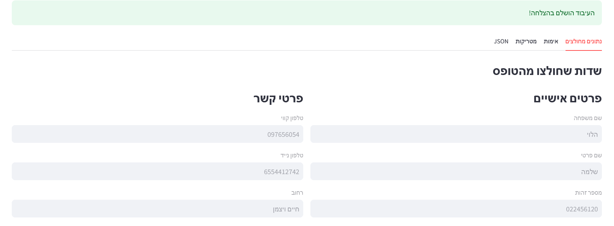
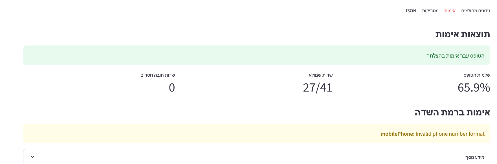
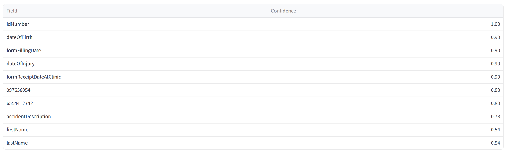
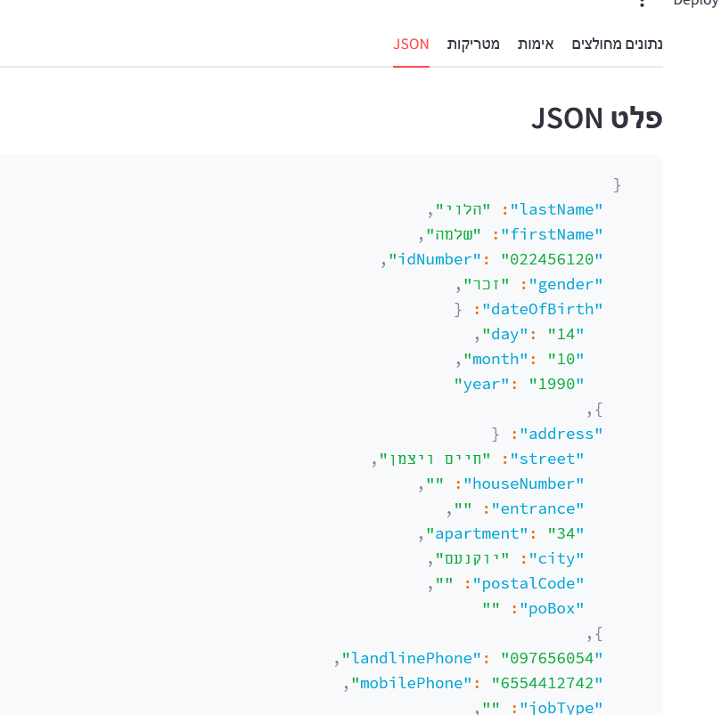

# Form Extraction System - Israeli National Insurance (ביטוח לאומי)


## Overview

This project implements an AI-powered system for extracting information from Israeli National Insurance Institute (ביטוח לאומי) forms
- **Azure Document Intelligence** for OCR
- **Azure OpenAI (gpt-4o)** for intelligent field extraction.
- **A Platform** for uploading documents and viewing extracted data in JSON format.


## Installation

1. Clone the repository:
```bash
git clone https://github.com/golyuval/KPMG-GenAI.git
cd Part_1
```

2. Create a virtual environment:
```bash
python -m venv venv
source venv\Scripts\activate
```

3. Install dependencies:
```bash
pip install -r requirements.txt
```

4. Set up environment variables:
Create a `.env` file in the project root with the following:
```env
# Azure Document Intelligence
AZURE_DOC_INT_KEY= ...
AZURE_DOC_INT_ENDPOINT= ...

# Azure OpenAI
AZURE_OPENAI_KEY= ...
AZURE_OPENAI_VERSION= ...
AZURE_OPENAI_ENDPOINT= ...

```

## Usage

1. Start the application:
```bash
streamlit run app.py
```

2. Open your browser to `http://localhost:8501`


3. Upload a form document (PDF, JPG, JPEG, or PNG)


4. Click "התחל עיבוד" (Start Processing) to extract data


5. View results in different tabs:
   - **נתונים מחולצים** (Extracted Data): View all extracted fields
   

   - **אימות** (Validation): See validation results and errors
   

   - **מטריקות** (Metrics): View confidence scores and statistics


   - **JSON**: Raw JSON output with download option
   

## Output Format

The system extracts the following fields in JSON format:

```json
{
  "lastName": "",
  "firstName": "",
  "idNumber": "",
  "gender": "",
  "dateOfBirth": {"day": "", "month": "", "year": ""},
  "address": {
    "street": "",
    "houseNumber": "",
    "entrance": "",
    "apartment": "",
    "city": "",
    "postalCode": "",
    "poBox": ""
  },
  "landlinePhone": "",
  "mobilePhone": "",
  "jobType": "",
  "dateOfInjury": {"day": "", "month": "", "year": ""},
  "timeOfInjury": "",
  "accidentLocation": "",
  "accidentAddress": "",
  "accidentDescription": "",
  "injuredBodyPart": "",
  "signature": "",
  "formFillingDate": {"day": "", "month": "", "year": ""},
  "formReceiptDateAtClinic": {"day": "", "month": "", "year": ""},
  "medicalInstitutionFields": {
    "healthFundMember": "",
    "natureOfAccident": "",
    "medicalDiagnoses": ""
  }
}
```

## Validation Features

The system includes comprehensive validation:

- **Field Completeness**: Checks for missing required fields
- **Format Validation**: Validates ID numbers, phone numbers, and dates
- **Confidence Scoring**: Assigns confidence scores to extracted fields
- **Accuracy Calculation**: Can compare against ground truth data

## Logging

The system implements comprehensive logging with:
- Separate info and error log files
- Timestamp-based log file naming
- Detailed formatting including module, function, and line numbers
- UTF-8 encoding for Hebrew content support

Log files are stored in the `Log/` directory with the format:
- `info_YYYYMMDD_HHMMSS.log`
- `error_YYYYMMDD_HHMMSS.log`

## Configuration

Key configuration parameters in `config.py`:
- `confidence`: Minimum confidence threshold (default: 0.8)
- `max_retries`: Maximum retry attempts for extraction (default: 3)
- `openai_model`: GPT model to use (default: "gpt-4o")

## Error Handling

The system includes robust error handling for:
- Invalid file formats
- OCR processing failures
- API connection issues
- Validation errors
- Missing or malformed data

## Performance Considerations

- OCR processing time depends on document complexity
- GPT-4o extraction typically takes 2-5 seconds
- Supports documents up to 20 pages
- Optimized for forms with clear text and structure

## Troubleshooting

### Common Issues

1. **OCR fails to extract text**
   - Ensure document quality is sufficient (300 DPI recommended)
   - Check Azure Document Intelligence endpoint and key

2. **Field extraction returns empty values**
   - Verify the form contains the expected fields
   - Check if the form language matches Hebrew/English

3. **Validation errors**
   - Review the validation tab for specific field issues
   - Ensure required fields are present in the document

## Future Enhancements

- Support for additional form types
- Batch processing capabilities
- Integration with database storage
- Enhanced confidence scoring algorithms
- Multi-language support beyond Hebrew/English

## Contact

For questions or issues, please contact Dor Getter.

## License

This project is part of the KPMG GenAI Developer Assessment.

## Features

- **Multi-format Support**: Handles PDF, JPG, JPEG, and PNG files

- **Intelligent OCR**: Uses Azure Document Intelligence for accurate text extraction
- **AI-powered Field Extraction**: Leverages GPT-4o for intelligent field identification and extraction
- **Comprehensive Validation**: Validates extracted data for completeness and accuracy
- **Real-time Processing**: Provides immediate feedback with progress indicators
- **Export Functionality**: Download extracted data as JSON files
- **Detailed Logging**: Separate error and info logs with timestamp-based file creation

## Architecture

### Key Components

1. **OCR Service** (`ocr.py`)
   - Integrates with Azure Document Intelligence
   - Extracts text, tables, and key-value pairs
   - Processes multi-page documents

2. **Extractor Service** (`extractor.py`)
   - Uses GPT-4o for intelligent field extraction
   - Implements retry logic for reliability
   - Handles Hebrew/English content seamlessly

3. **Validator Service** (`validator.py`)
   - Validates data completeness and format
   - Calculates confidence scores
   - Provides detailed validation reports

4. **Web Interface** (`app.py`)
   - Built with Streamlit
   - Real-time processing feedback

## Prerequisites

- Python 3.8 or higher
- Azure Document Intelligence resource
- Azure OpenAI resource with GPT-4o access
- Azure credentials (provided separately)
