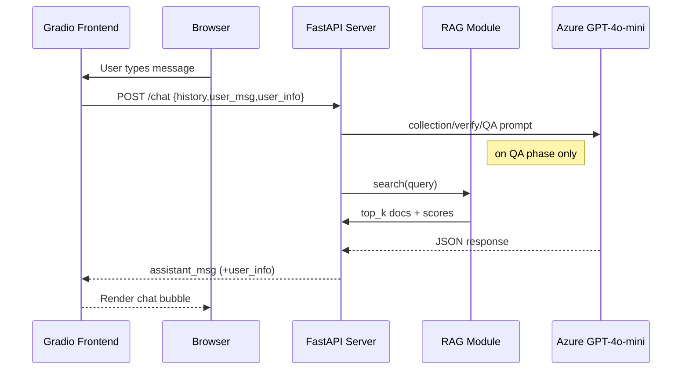

# Part 2 – HMO Chatbot (RAG)

## 1. Business Purpose
Provide insured members with instant, tier-specific answers about services in Israel's three HMOs (מכבי, מאוחדת, כללית). The flow mimics a call-center agent: collect personal info → confirm → answer questions.

## 2. System Diagram


## 3. File Tour & Responsibilities
| File | Role |
|------|------|
| `Server/app.py` | Starts FastAPI, mounts router |
| `Server/routes.py` | Defines `/chat` + health/log endpoints |
| `Server/services.py` | **Brain** – state machine (`collect`, `verify`, `qa`) |
| `Server/rag.py` | Build FAISS index from HTML, search with cache |
| `Server/schemas.py` | Pydantic models returned by output parsers |
| `Client/app.py` | Gradio UI, phase indicator, REST caller |
| `Core/config.py` | Prompts, env vars, validation constants |
| `Core/logger_setup.py` | Unified logging to console + `Part_2/Log` |

## 4. State Machine Logic (`services.py`)
```
if not user_info_state:       # Phase 1 – collection
    assistant_msg, new_info = collect(...)
elif not user_info_state["verified"]:   # Phase 1.5 – verification
    assistant_msg, new_info = verify(...)
else:                         # Phase 2 – QA
    assistant_msg = qa(...)
```
* **LLM wrappers**: `AzureChatOpenAI` for chat; `AzureOpenAIEmbeddings` for embeddings.
* **Parsers**: `PydanticOutputParser` uses `schemas.UserInfoResponse` & `VerificationResponse` to guarantee JSON validity.

## 5. Retrieval-Augmented Generation
### 5.1 Building the Vector Store
* Source files: `Data/phase2_data/*.html` (one per HMO).
* `BeautifulSoup` strips scripts/styles & groups by header tags (h1–h4).
* Text split: `RecursiveCharacterTextSplitter(chunk_size=1000, overlap=200)`.
* Embedding: `AzureOpenAIEmbeddings` (model `text-embedding-ada-002`).
* Store: `FAISS.from_documents()` – memory-only, built at startup.

### 5.2 Search Path
```
RAG.search(query,k=4)
    -> cache? yes → return
    -> vstore.similarity_search_with_score
    -> craft metadata (avg_score, retrieval_time, preview)
    -> cache result (max 1000)
```

## 6. Configuration Highlights (`Core/config.py`)
* **System prompts**
  * `chatbot_system_collection` – gather user info.
  * `chatbot_system_verification` – confirm or edit.
  * `chatbot_system_qa` – final answer with context & user details.
* **Validation lists**: `validation_hmo`, `validation_tiers`, age range.
* **Session cleanup**: `session_timeout=1800s`; `cleanup_old_sessions()` runs per request.

## 7. Logging & Monitoring Endpoints
| Endpoint | Description |
|----------|-------------|
| `/health` | returns 200 if server alive |
| `/rag-stats` | current search_count, cache hits/misses |
| `/token-usage` | accumulative OpenAI token usage & cost |
| `/logs/info` / `/logs/error` | tail of log files |

## 8. Dependency Rationale
| Package | Reason |
|---------|--------|
| fastapi & uvicorn | REST server |
| gradio | Lightweight chat UI |
| langchain(-openai,-community) | Embedding, text split, ConversationalChain |
| faiss-cpu | Vector similarity |
| beautifulsoup4 + lxml | HTML parsing |
| python-dotenv | env vars |
| openai | Azure Chat & embeddings |

### 8-bis. Detailed Tools, Libraries & Concepts
Below is an expanded map that links each major **tool, library, or architectural concept** to its exact usage point in the codebase.

#### Cloud Services
1. **Azure OpenAI** – Chat completions (`AzureChatOpenAI` in `services.py`) and embeddings (`AzureOpenAIEmbeddings` in `rag.py`).
2. **Azure Storage (implicit)** – Could host HTML knowledge base in prod; currently files live in `Data/phase2_data`.

#### Backend Framework & Serving
| Library | Purpose | Key Files |
|---------|---------|-----------|
| `fastapi` | Define REST endpoints, dependency injection | `Server/app.py`, `Server/routes.py` |
| `uvicorn` | Async ASGI server for FastAPI | run command in README |
| `pydantic` | Parse & validate JSON returned by GPT (`UserInfoResponse`, `VerificationResponse`) | `Server/schemas.py`, `services.py` |
| `python-multipart` | Handle form-data (pulled in by FastAPI) | dependency only |

#### Retrieval & LLM Stack
| Library | Purpose | Where Used |
|---------|---------|-----------|
| `langchain` | Chains, memory, prompt templates | `services.py` (`ConversationalRetrievalChain`, `PromptTemplate`) |
| `langchain-openai` | Azure-specific wrappers | `services.py`, `rag.py` |
| `langchain-community` | FAISS vector store integration | `rag.py` |
| `faiss-cpu` | In-memory vector similarity search | `rag.py` (built at startup) |

#### Parsing / Pre-processing
| Library | Purpose | Key Files |
|---------|---------|-----------|
| `beautifulsoup4` + `lxml` | Strip HTML tags, extract sections | `rag.py::parse_html()` |
| `regex` (via `re`) | Detect HMO headers, sanitise input | `rag.py`, `services.validate_input()` |

#### Front-End & Client
| Library | Purpose | Key Files |
|---------|---------|-----------|
| `gradio` | Out-of-the-box chat component, CSS overrides | `Client/app.py` |
| `requests` | Client-side HTTP calls to backend | `Client/app.py::talk()` |

#### Core Architectural Concepts
| Concept | Why It Matters | Implementation |
|---------|----------------|-----------------|
| **State Machine (3 phases)** | Ensures orderly flow from data collection → verification → Q&A | Branching logic in `services.py` |
| **RAG** | Combines knowledge base with conversation context | `rag.py` + QA prompt in `Core/config.py` |
| **Caching Layer** | Prevents redundant FAISS searches (latency + cost) | `rag.cache` dict keyed by md5(query) |
| **Session TTL** | Frees memory and avoids stale chains | `cleanup_old_sessions()` |
| **Prompt Injection Mitigation** | Simple pattern blacklist | `services.validate_input()` |
| **Cost Tracking** | Live tally of tokens × price | `token_usage` dict updated per response |
| **Mermaid Sequence Diagram** | Quick mental model for interviews | Section 2 above |

> Keep this matrix handy: it lets you answer _"Which file imports BeautifulSoup and why?"_ in one sentence.

## 9. Demo Checklist
```bash
# venv active & env vars in .env
pip install -r Part_2/requirements.txt

# Terminal-1
python Part_2/Server/app.py  # http://localhost:8000

# Terminal-2
python Part_2/Client/app.py  # http://localhost:7860
```
Ask: "מה ההשתתפות העצמית שלי לבדיקת דם?" after completing collection + verification phases.

## 10. Common Failure Cases & Fixes
| Issue | Mitigation |
|-------|------------|
| RAG returns irrelevant docs | Increase k, adjust split size, re-train embeddings |
| JSON parse errors | `PydanticOutputParser` + Azure JSON mode prevent free-text |
| Session memory leak | `cleanup_old_sessions()` drops stale chains |
| Unauthorised endpoints | TODO in README → add API-key dependency |

## 11. Extensibility Talking Points
* Switch to **persistent FAISS** on disk or Azure Cognitive Search.
* Add **language detection** earlier to set `AzureOpenAIEmbeddings` locale.
* Integrate **Redis** for session & cache.
* Add **unit tests** in `Test/` (placeholder now).

## 12. Interview Cheat-Sheet – 10 Crucial Q&A
| # | Question | Answer Sketch |
|---|----------|---------------|
|1|Why two LLM phases before QA? | Ensures accurate user profile which filters RAG answers (HMO, tier).|
|2|How is JSON validity enforced? | PydanticOutputParser parses model output; schema mismatch raises error.|
|3|Why FAISS over Elasticsearch? | Lightweight, in-memory, zero infra, fast cosine/L2 search for POC.|
|4|Explain cache key design. | md5(query)+k avoids large string keys; LRU trim to 1,000.|
|5|How are token costs tracked? | `response_metadata.token_usage` → accumulative dict + pricing table.|
|6|What prevents prompt injection? | `validate_input()` filters dangerous patterns; can add OpenAI moderation.|
|7|How would you secure routes? | `Depends(api_key_header)`, CORS, HTTPS, rate limit.|
|8|How to add new HMO? | Place new HTML under `Data/phase2_data`, restart server; indexing auto-parses.|
|9|Scaling strategy? | Containerize; use Azure Container Apps; persistent FAISS; Azure Functions for chat.|
|10|Why Gradio instead of Streamlit here? | Built-in chatbot component, public share link, easier CSS tweaks. 